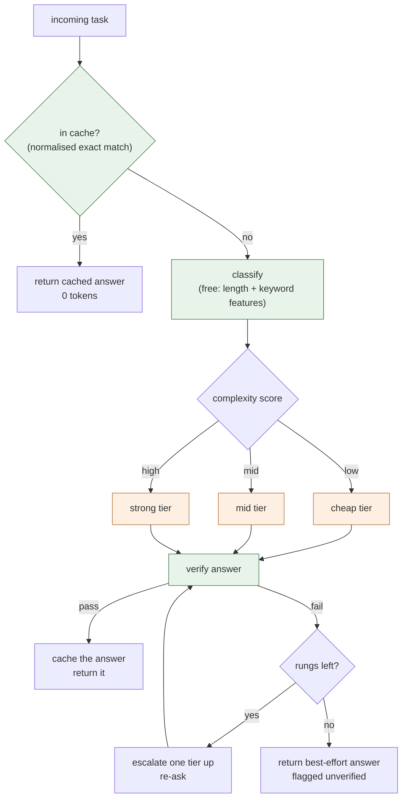
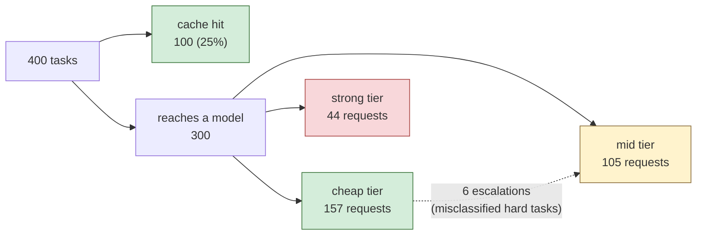
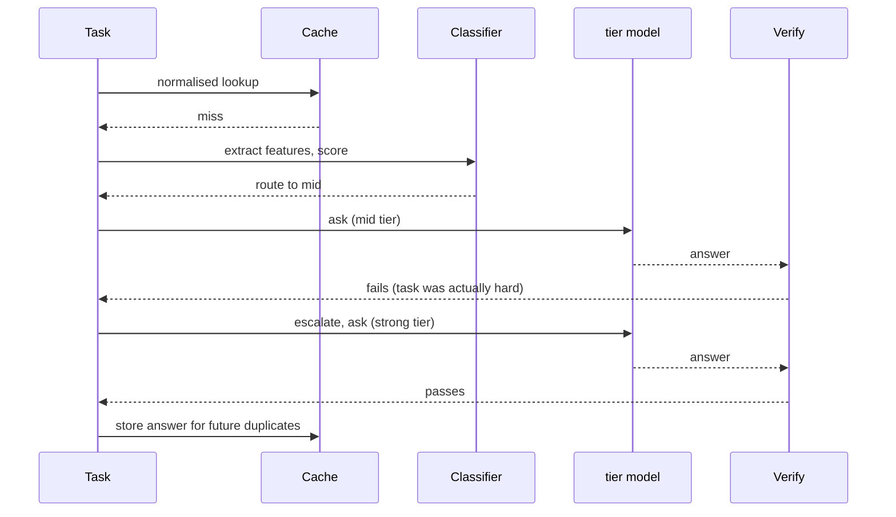
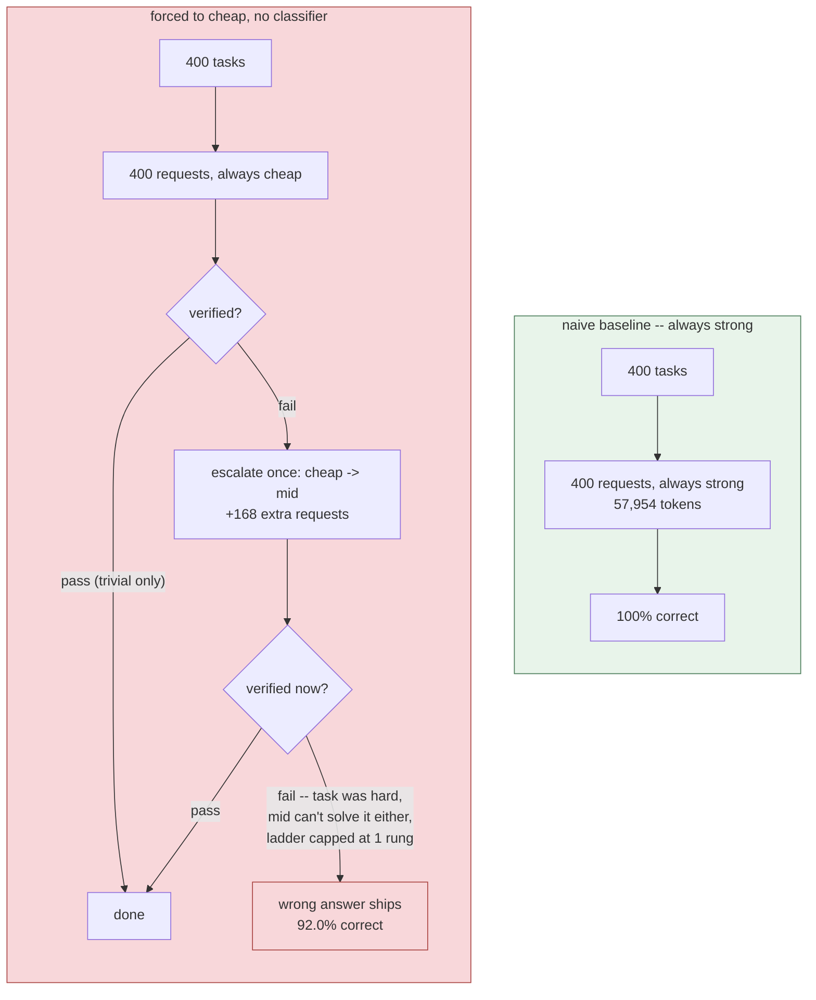
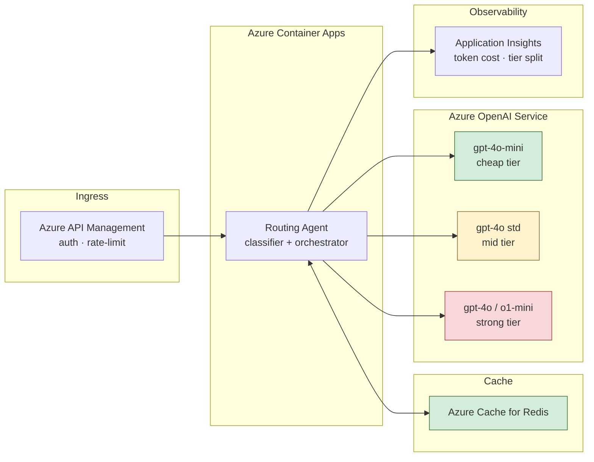

# model-routing-agent

A tiered LLM router built to answer one question:

> If most incoming tasks are easy, how much can you save by only sending the
> hard ones to your most expensive model — without a human ever noticing the
> difference in answer quality?

On a 400-task corpus (211 trivial, 134 moderate, 55 hard, with 100 paraphrased
duplicates mixed in), the answer measured here is **57,954 → 37,298 tokens
(35.6%), $0.4080 → $0.1340 (67.2%)**, at **100% correctness on both sides** —
routing recovers every misclassification through verification-gated
escalation before it ever reaches a user.

Everything runs offline. There is no API key and no network call: the task
corpus is generated deterministically, the per-tier model is a real capability
simulation with a documented ceiling (not a coin flip), and every number below
comes from `benchmarks/` in CI.

---

## The idea

Most requests to an LLM system are not hard. A router's job is to notice that
cheaply, before spending a single model token finding out — and to have a
fallback for the cases it gets wrong, because a heuristic classifier is never
perfect.

Three parts, in a fixed order:

1. **Cache first.** If a near-identical task has been answered correctly
   before, skip both classification and the model call entirely. Measured:
   100 of 400 tasks (25%) never reach the model.
2. **Classify for free.** A handful of length and keyword features, computed
   in microseconds with no model call, route the task to the cheapest tier
   estimated to handle it.
3. **Verify, then escalate — never retry blind.** If the tier's answer fails
   verification, the task moves up exactly one rung and is asked again. It
   never asks the same tier twice, and it never silently accepts a wrong
   answer to save a few cents.

The uncomfortable finding this design exists to avoid: **routing without
escalation is a token-cost table with a correctness footnote.** See the
ablation section — turning escalation off keeps almost all the savings and
loses 1.5 points of accuracy. Whether that trade is acceptable depends
entirely on what the task is, which is exactly the kind of thing a benchmark
should force you to say out loud instead of averaging away.

---

## Architecture

### Per-task decision flow



Green stages spend no model tokens. Orange stages are the only place cost is
incurred, and the whole design is aimed at keeping traffic in the cheapest
orange box that can actually answer it.

### Where 400 tasks actually went



### A single task, sequence view



### The floor-of-the-ladder failure mode

The most important diagram in this README. It is what "no routing" actually
looks like once escalation is layered on top of a bad first guess.



**Forcing everything to cheap costs *more* total tokens than the naive
baseline (65,097 vs 57,954) and is *less* correct (92.0% vs 100%).** A classifier
that gets the easy 90% right for free is what makes routing a net win; without
it, the escalation traffic alone outspends just asking the good model once,
and a one-rung escalation cap can't fully compensate for a bad first guess.
This is the paper-thin line between "routing" and "a slower, more expensive,
less accurate version of the naive baseline" — and it is why `force_tier`
exists as a lever in `config.py` rather than being left untestable.

---

## Azure production deployment

The same three-stage pipeline (cache → classify → escalate) runs on Azure
with no architectural changes to the routing logic — only the cache backend
and model endpoints are swapped for managed Azure services.



Full architecture detail, security design, multi-region topology, and
retuning guidance: [docs/azure-architecture.md](docs/azure-architecture.md).

---

## Measured results

Reproduce with `python benchmarks/compare.py`.

```
CORPUS
  400 tasks  (300 unique, 100 paraphrased duplicates)
  by category: {'trivial': 211, 'moderate': 134, 'hard': 55}

NAIVE (always strong model) vs ROUTED
--------------------------------------------------------------
                                     naive      routed   saved
model requests                         400         306   23.5%
input tokens                        22,872      12,839   43.9%
output tokens                       35,082      24,459   30.3%
total tokens                        57,954      37,298   35.6%
cost                          $     0.4080$     0.1340   67.2%

WHERE THE TRAFFIC WENT
  cheap     157 requests
  mid       105 requests
  strong     44 requests
  cache hits     100  (hit rate 25.0%)
  escalations      6

CORRECTNESS: naive 400/400   routed 400/400
```

Cost falls further than tokens (67.2% vs 35.6%) because routing does two
things at once: it removes tokens, and it moves the remaining tokens to
cheaper per-token pricing. A token-only metric would understate the win here,
which is the opposite problem from the other repos in this series, where a
token reduction was the whole story — worth stating plainly rather than
picking whichever number looks better.

### Lever ablation

Reproduce with `python benchmarks/ablation.py`.

| configuration | tokens | requests | accuracy | vs all-levers-on |
|---|---:|---:|---:|---|
| naive (always strong) | 57,954 | 400 | 100.0% | +55% tokens |
| **all levers on** | **37,298** | **306** | **100.0%** | — |
| no caching | 48,226 | 406 | 100.0% | +29% tokens |
| no escalation | 35,670 | 301 | **98.5%** | −4% tokens |
| no routing — forced to cheap | 65,097 | 568 | **92.0%** | +75% tokens |
| no routing — forced to strong | 57,954 | 400 | 100.0% | +55% tokens |

Two rows earn a second look.

**"No escalation" looks like a free lunch and isn't.** It shows a token
*saving* over the full pipeline (fewer re-asks) while losing 1.5 points of
accuracy — the 6 hard tasks the classifier under-scores onto the mid tier
simply ship wrong. Whether a 1.5-point accuracy loss is worth ~4% fewer tokens
is a product decision, not an engineering one, and this table is built so that
decision has to be made explicitly rather than defaulting to whichever
configuration has the smaller number in one column.

**"Forced to cheap" is worse on every axis, not a trade-off.** More tokens
than even the honest naive baseline, and the worst accuracy on the table. This
is the floor-of-the-ladder failure mode diagrammed above: escalating from the
bottom of a misjudged ladder costs the retry *and* still doesn't always reach
a tier that can solve the task within the default one-rung cap.

### Cost savings at production scale

The per-task saving (67.2%) projects linearly to production volumes. Numbers
below use the benchmark's measured cost-per-task ($0.001020 naive vs.
$0.000335 routed) applied to pay-as-you-go Azure OpenAI pricing.

| Monthly tasks | Naive cost | Routed cost | Monthly saving | Annual saving |
|---|---:|---:|---:|---:|
| 100K | $102 | $33.50 | $68.50 | $822 |
| 1M | $1,020 | $335 | $685 | $8,220 |
| 10M | $10,200 | $3,350 | $6,850 | $82,200 |
| 50M | $51,000 | $16,750 | $34,250 | $411,000 |

The Azure infrastructure overhead (Redis, Container Apps, APIM, monitoring)
adds approximately $110–165/month — fixed cost that disappears into noise
above ~250K tasks/month. See [docs/azure-architecture.md](docs/azure-architecture.md)
for the full breakdown.

---

## A bug found in the corpus itself

The initial task generator drew each task from ~6 templates × 10 symbol
placeholders per category. With roughly 300 originals and only 60–180 possible
combinations per category, independent originals collided by chance far more
often than the deliberately-injected paraphrase duplicates did. The cache's
70%+ hit rate under that corpus was real, but **unattributable** — there was
no way to tell "the normaliser correctly matched a paraphrase" from "two
unrelated originals happened to render identically."

The fix gives every original task a unique case reference (`(case #0184)`), so
accidental collisions are eliminated and every cache hit traces to a
deliberate, labelled duplicate. Cache-hit count now equals the duplicate count
exactly (`test_caching_eliminates_requests_for_duplicate_tasks`), rather than
being an unfalsifiable number nobody could audit. The parallel to
`migration-agent`'s ground-truth-counting bug is intentional — a benchmark
that cannot check its own labels isn't measuring what it claims to.

---

## Quick start

```bash
pip install -r requirements.txt

python -m pytest tests/ -q       # 34 tests, no network
python benchmarks/compare.py     # naive vs routed
python benchmarks/ablation.py    # per-lever contribution
```

No `.env` file and no API key: `OfflineModel` genuinely evaluates each task's
category against each tier's declared capability ceiling (with a bounded,
deterministic chance of lucky/unlucky outcomes outside it), so a regression in
routing, escalation, or verification changes the *correctness* numbers, not
just a mocked cost figure.

---

## Layout

| path | role |
|---|---|
| `src/router/tasks.py` | Deterministic synthetic task corpus + answer key |
| `src/router/features.py` | Free, LLM-free complexity signal extraction |
| `src/router/classifier.py` | Deterministic scoring + tier selection |
| `src/router/tiers.py` | Tier definitions, pricing, escalation ladder |
| `src/router/cache.py` | Normalised exact-match answer cache |
| `src/router/model.py` | Per-tier capability simulation, real prompt construction |
| `src/router/pipeline.py` | Orchestration: cache → classify → ask → verify → escalate |
| `benchmarks/` | `compare.py`, `ablation.py` — both run in CI |

Further reading: [architecture](docs/architecture.md) ·
[tuning](docs/tuning.md) · [evaluation](docs/evaluation.md) ·
[Azure solution architecture](docs/azure-architecture.md).

## License

MIT
