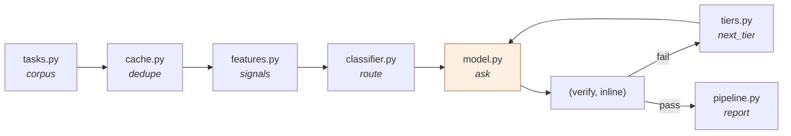

# Architecture

The rule governing this pipeline: **every stage before a model call exists to
decide whether the call is necessary and, if so, to the cheapest tier that can
answer it; every stage after exists to make sure that decision was right
before the answer ships.**

## Stage 1 — `cache.py`: dedupe before anything else

Support and dev-task traffic repeats. The cache normalises text (lowercase,
collapse whitespace, strip a small set of known greeting/framing prefixes) and
looks up an exact match against previously **verified-correct** answers.

It deliberately does not do embedding-based similarity matching. A real
semantic cache would catch true paraphrases this one misses — but computing an
embedding is itself a model call, and spending tokens to decide whether to
spend tokens defeats the stage's purpose. The trade-off is explicit: this
cache only catches restatements close enough that a cheap string
normalisation finds them.

Only correct answers are cached (`pipeline.py`'s `run()` only calls
`cache.put` after verification passes). Caching a wrong answer would compound
one mistake across every future duplicate of that question — a bad answer
served to one user is unfortunate, but the same bad answer autoserved forever
is a regression multiplier.

## Stage 2 — `features.py`: free complexity signals

Six numbers, computed with string operations only: length, word count,
question-mark count, and three keyword-hit counts (hard/moderate/trivial
signal phrases drawn from the domain, e.g. "root cause", "race condition",
"write unit tests", "what does the"). No model call, no network,
microseconds.

## Stage 3 — `classifier.py`: score and route

A small weighted sum over the features maps to a 0–1 complexity score;
`ClassifierThresholds` in `config.py` cuts that score into three tiers. This
is deliberately not a trained model — a hand-weighted heuristic is what most
real routing layers start with, and it makes every routing decision
auditable: you can read the score and know exactly why a task landed where it
did.

It is not perfect, and the repo does not pretend it is. See "the classifier's
known gap" in `docs/tuning.md` and the escalation mechanism that exists
specifically to cover for it.

## Stage 4 — `tiers.py`: pricing and the escalation ladder

Three tiers (`cheap`, `mid`, `strong`), each with published-style per-million
pricing and a declared capability ceiling (which task categories it reliably
solves). `next_tier()` walks the ladder one rung at a time — there is no
"jump straight to strong," because escalating one rung at a time is what makes
the cost of a bad classification visible in the benchmark instead of hidden
behind an unconditional retry-at-the-top policy.

## Stage 5 — `model.py`: capability simulation

`OfflineModel` does not have access to the ground-truth category through a
side channel — it is not told "this is a hard task, fail if you're cheap." It
builds a real prompt (system prompt + task text), counts real tokens with
`tiktoken`, and decides correctness from the tier's declared `solves` set (with
a small deterministic chance of getting lucky or unlucky outside it, seeded
from a hash of the task ID so results are reproducible). Stronger tiers also
produce measurably longer, more thorough synthesized answers — output tokens
scale with tier, not just input.

This is the same design principle as `migration-agent`'s `OfflineModel`: a
fake that does real work, so a prompt-construction regression shows up as a
wrong answer, not as a silently-passing mock.

## Stage 6 — verification and escalation, inline in `pipeline.py`

There is no separate `verify.py` in this repo because verification here is a
single fact already computed by `model.py`: did this tier's answer fall
inside its capability ceiling. In a system with a real model, this stage would
be a rubric, a test suite, or a human-in-the-loop check — the pipeline's
control flow around it (escalate the failing cluster, cap the rungs, never
retry the same tier) is the part meant to generalise; the specific check is
not. See docs/evaluation.md for what that means for these numbers.

`RoutingAgent.run()` enforces the order: cache → classify → ask → verify →
escalate (bounded by `max_escalations`) → cache the final correct answer. A
`force_tier` setting bypasses the classifier entirely for ablation and is not
intended for production use — seeing "always cheap" and "always strong" as
concrete rows in a table is what turns "routing helps" into a falsifiable
claim.
