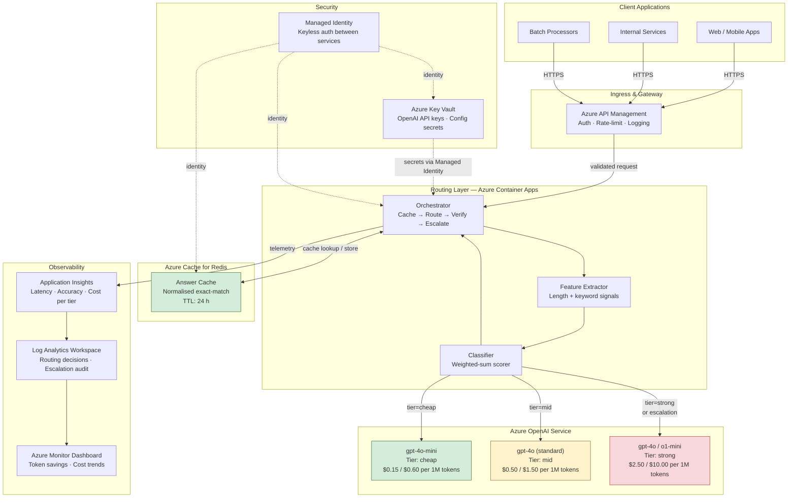
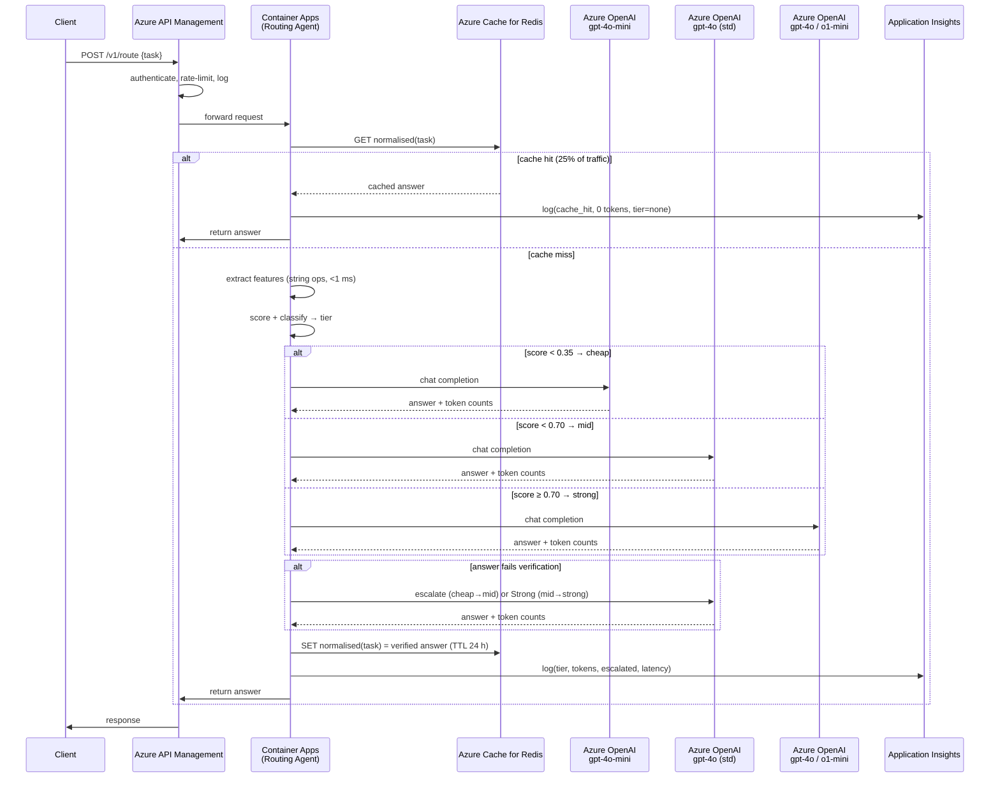
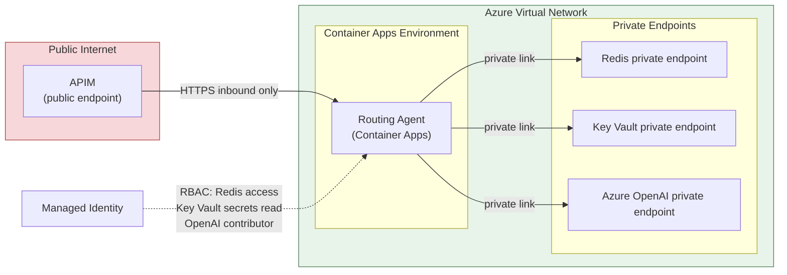
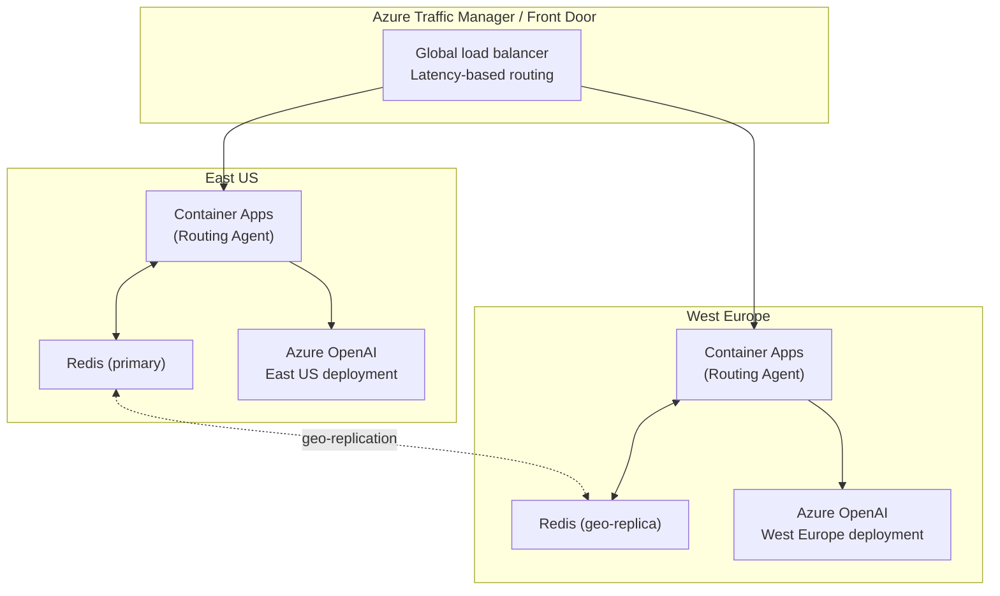

# Azure Solution Architecture

This document describes how the model-routing-agent would be deployed as a
production service on Azure, including the Azure services used, request flow,
and cost savings achieved by the tiered routing strategy at production scale.

---

## High-Level Architecture



---

## Azure Components

| Service | Role | SKU / Notes |
|---|---|---|
| **Azure API Management** | API gateway — authentication, rate limiting, request logging, developer portal | Consumption or Developer tier |
| **Azure Container Apps** | Hosts the routing agent; serverless auto-scaling, no infrastructure management | Consumption plan — scales to zero |
| **Azure Cache for Redis** | Persistent distributed answer cache — replaces in-memory cache for multi-replica deployments | C1 Standard (1 GB) |
| **Azure OpenAI Service** | LLM inference for all three tiers; PTU or pay-as-you-go deployments | Separate deployments per tier |
| **Azure Key Vault** | Stores OpenAI API keys and any per-tier configuration secrets | Standard tier |
| **Azure Managed Identity** | Keyless authentication between Container Apps, Key Vault, and Redis | System-assigned |
| **Application Insights** | Real-time telemetry — routing decisions, per-tier latency, escalation rate, accuracy | Linked to Log Analytics |
| **Log Analytics Workspace** | Long-term storage for routing audit log and cost attribution per tier | Pay-as-you-go |
| **Azure Monitor Workbook** | Cost dashboard: token savings vs. naive baseline, tier traffic split, cache hit rate | Custom workbook |
| **Azure Virtual Network** | Network isolation — Container Apps environment and Redis on private endpoints | Optional, recommended for production |

---

## Request Flow



---

## Azure OpenAI Tier Mapping

The three routing tiers map directly to Azure OpenAI deployments. Pricing shown
is pay-as-you-go; provisioned throughput units (PTU) reduce per-token cost
further at committed volume.

| Router tier | Azure OpenAI model | Input $/1M | Output $/1M | Capability |
|---|---|---:|---:|---|
| **cheap** | `gpt-4o-mini` | $0.15 | $0.60 | Trivial tasks — short factual lookups, typos, simple definitions |
| **mid** | `gpt-4o` (standard) | $0.50 | $1.50 | Moderate tasks — unit tests, summaries, standard refactors |
| **strong** | `gpt-4o` / `o1-mini` | $2.50 | $10.00 | Hard tasks — root cause analysis, concurrent bugs, high-stakes decisions |

PTU deployments can lower the effective per-token rate by 30–50% at sustained
throughput, compounding the routing savings further.

---

## Cost Savings at Production Scale

### Per-task baseline (from benchmark — 400-task corpus)

| Metric | Naive (always strong) | Routed | Saving |
|---|---:|---:|---:|
| Model requests | 400 | 306 | −23.5% |
| Input tokens | 22,872 | 12,839 | −43.9% |
| Output tokens | 35,082 | 24,459 | −30.3% |
| **Total tokens** | **57,954** | **37,298** | **−35.6%** |
| **Cost (400 tasks)** | **$0.4080** | **$0.1340** | **−67.2%** |
| Cost per task | $0.001020 | $0.000335 | −67.2% |

Cost falls further than tokens (67.2% vs. 35.6%) because routing does two
things simultaneously: it removes tokens from the bill *and* moves the
remaining tokens to cheaper per-token pricing.

### Projected monthly LLM cost at production volume

| Monthly task volume | Naive (always strong) | Routed | Monthly saving | Annual saving |
|---|---:|---:|---:|---:|
| 10K | $10.20 | $3.35 | $6.85 | $82 |
| 100K | $102 | $33.50 | $68.50 | $822 |
| 500K | $510 | $167.50 | $342.50 | $4,110 |
| 1M | $1,020 | $335 | $685 | $8,220 |
| 5M | $5,100 | $1,675 | $3,425 | $41,100 |
| 10M | $10,200 | $3,350 | $6,850 | $82,200 |
| 50M | $51,000 | $16,750 | $34,250 | $411,000 |

### Lever contribution (where savings come from)

| Mechanism | Token impact | Cost impact | Notes |
|---|---|---|---|
| **Cache (25% hit rate)** | −25% requests reach model | −25% on all tiers | Zero tokens spent on cache hits |
| **Tier routing** | Remaining tokens priced at cheaper rates | Multiplies savings per token | CHEAP is 16.7× cheaper input than STRONG |
| **Escalation** | +2% re-asks (6/306 requests) | Minor cost recovery | Ensures 100% accuracy without blind retries |
| **Combined** | −35.6% total tokens | **−67.2% total cost** | Cost saving > token saving because of tier pricing |

---

## Azure Infrastructure Cost Estimate

Fixed monthly overhead to run the routing service on Azure:

| Service | SKU | Estimated monthly cost |
|---|---|---:|
| Azure Container Apps | Consumption — 2 vCPU baseline, auto-scale | $30–75 |
| Azure Cache for Redis | C1 Standard (1 GB, 99.9% SLA) | $55 |
| Azure API Management | Consumption tier (~1M calls/month) | $3.50/1M calls |
| Application Insights + Log Analytics | 5 GB/day ingestion | $15–30 |
| Azure Key Vault | Standard (< 10K operations/month) | $4 |
| **Total fixed overhead** | | **~$110–165/month** |

At 100K tasks/month, monthly LLM savings ($68.50) already approach the
infrastructure overhead. Break-even occurs at approximately **200K–250K
tasks/month**; above that, every additional task nets the full 67.2% saving.

```mermaid
xychart-beta
    title "Monthly LLM cost: Naive vs. Routed (USD)"
    x-axis ["10K", "100K", "500K", "1M", "5M", "10M"]
    y-axis "Cost (USD)" 0 --> 12000
    bar [10.20, 102, 510, 1020, 5100, 10200]
    bar [3.35, 33.50, 167.50, 335, 1675, 3350]
```



---

## Observability and Cost Attribution

Application Insights custom events capture everything needed to track routing
performance in production:

```json
{
  "event": "routing_decision",
  "task_id": "...",
  "tier": "mid",
  "cache_hit": false,
  "escalated": false,
  "input_tokens": 143,
  "output_tokens": 312,
  "cost_usd": 0.000538,
  "verified": true,
  "latency_ms": 820
}
```

Recommended Azure Monitor Workbook panels:
- **Token savings vs. naive** — rolling 7-day comparison
- **Tier traffic split** — cheap / mid / strong / cache pie or stacked bar
- **Escalation rate** — should stay under 3% for a well-tuned classifier
- **Cache hit rate** — should stay near 25% for this task distribution
- **Cost per tier** — identify which tier drives the most spend
- **Accuracy proxy** — escalations that reached the top of the ladder without
  a verified answer (signals classifier threshold drift)

---

## Security Architecture



- All Azure OpenAI, Redis, and Key Vault traffic stays on the private
  backbone — no data crosses the public internet after APIM.
- Managed Identity eliminates stored credentials. The routing agent never
  handles an API key directly.
- APIM enforces OAuth 2.0 / API-key authentication before any request
  reaches the routing layer.

---

## Deployment Topology

For high availability, deploy the routing agent as a multi-region active–active
setup with geo-replicated Redis:



Geo-replication of the Redis cache means answers cached in East US propagate
to West Europe within seconds, so cache hits benefit users in both regions
without each region having to warm its own cache independently.

---

## Retuning for Production Traffic

The three defaults most likely to need re-deriving once real traffic flows:

1. **Classifier thresholds** — the 0.35 / 0.70 thresholds are calibrated to
   this synthetic corpus. Real support/dev traffic will have a different
   hard-task density. Derive new thresholds by sampling a week of production
   requests, labelling them by human reviewers or a strong model, and running
   `benchmarks/ablation.py` against the labelled set.
2. **Cache filler-prefix list** — the current list (`"quick one:"`,
   `"hey,"`, etc.) was guessed from expected patterns. Derive the real list
   from production duplicate-request logs using n-gram prefix frequency.
3. **`max_escalations`** — one rung works for a 3-tier ladder where the
   classifier rarely misses by more than one tier. If traffic analysis shows
   misclassifications spanning two tiers, increase to 2.
4. **Tier-model mapping** — if Azure OpenAI releases a model that fits
   between `gpt-4o-mini` and `gpt-4o` in capability and pricing, add it as
   a fourth rung and re-tune thresholds.

Further reading: [architecture](architecture.md) · [tuning](tuning.md) · [evaluation](evaluation.md)
